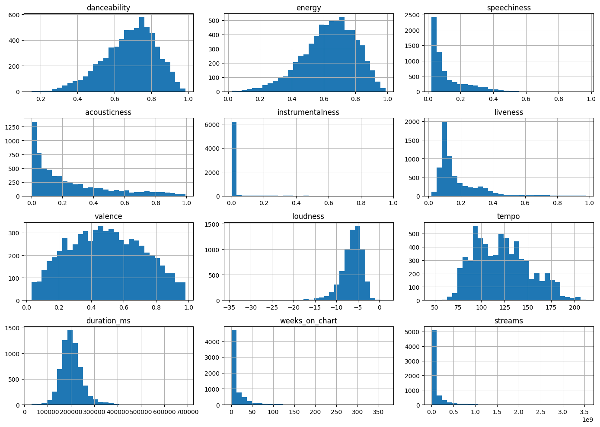
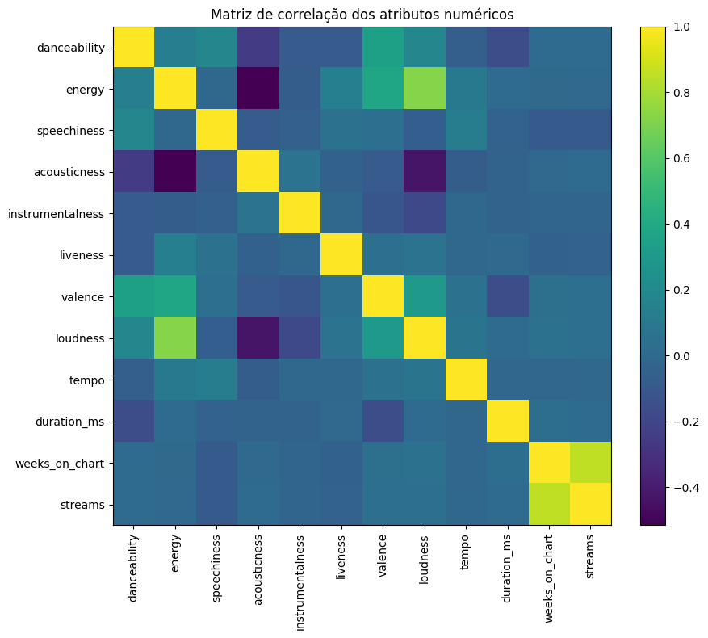
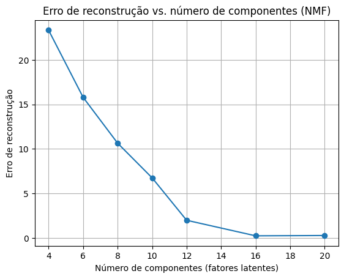

# 🎧 PROJETO APLICADO III: SISTEMA DE RECOMENDAÇÃO SPOTIFY  

Sistema de recomendação musical baseado em atributos sonoros das faixas do Spotify, utilizando **NMF (Non-negative Matrix Factorization)** e **similaridade do cosseno** para sugerir músicas semelhantes.

---

## 👥 Membros

- **Carolina Iaconelli** – RA: 10424853  
- **Felipe Akira Fukue** – RA: 10424046  
- **Ingryd Cristine Hidalgo Sella** – RA: 10424934  
- **Rafael Tapigliani Rodrigues** – RA: 10441243  

---

## 📂 Arquivo principal do projeto

Todo o código, experimentos e análises estão no notebook:

➡️ **`spotify_recommender_spotify_top_songs.ipynb`**

Nele você encontra:
- Carregamento da base de dados
- Análise Exploratória (EDA)
- Pré-processamento
- Modelagem com NMF
- Geração de recomendações
- Métricas e resultados

---

## 🎼 Base de Dados

Link do dataset utilizado (GIST):

📎 https://gist.githubusercontent.com/akira-fukue/b71f9e9197d9fc737ca7b999d4884993/raw/8141b41fca536c2c4d9b1c3c9e647032282171e5/spotify_top_songs_audio_features.csv

A base contém atributos sonoros como:
- *danceability*
- *energy*
- *valence*
- *tempo*
- *acousticness*
- *duration_ms*, entre outros.

---

## 📊 Análise Exploratória (EDA)

A pasta **`imagens/`** contém visualizações geradas durante a análise exploratória dos dados.

### 🔹 Distribuição dos Atributos

Visualização das distribuições dos principais atributos numéricos do dataset, permitindo identificar padrões, variações e possíveis assimetrias nos dados.

### 🔹 Matriz de Correlação

Mostra as correlações entre atributos sonoros, auxiliando na compreensão das relações entre variáveis do modelo.

### 🔹 Número de Componentes (NMF)

Gráfico do erro de reconstrução para diferentes números de componentes, utilizado para selecionar o valor ideal (**16 componentes**) no modelo NMF.

---

## 🧠 Tecnologias e Bibliotecas

- Python 3.x
- Pandas
- NumPy
- Scikit-learn
- Matplotlib

---

## ✅ Objetivo do Projeto

Construir uma prova de conceito de um sistema de recomendação capaz de sugerir músicas semelhantes com base em atributos de áudio sem depender de histórico de usuário.

---

## 🚀 Resultados (Resumo)

- Melhor configuração: **16 componentes na NMF**
- Erro de reconstrução: **≈ 0.2466**
- Similaridade média Top-10: **≈ 0.984**
- Recomendações com **alta coerência sonora**, porém **baixa diversidade**

---

## 📌 Observação

Este projeto é acadêmico e não possui integração com a API oficial do Spotify.  
Todas as análises são baseadas no dataset público descrito acima.

---

## 📄 Licença

Uso acadêmico e educacional.
